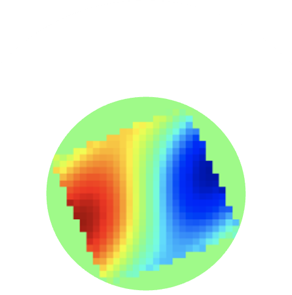

#  FCC-ee Impedance Wake Model


*A repository containing all elements of the FCC-ee impedance wake model.*

---

## 📂 Overview

This repository contains the **Impedance Wake Model** for the FCC-ee project.  
Here, you will find all the necessary elements, scripts, and data to work with the model.

---

## 🚀 Getting Started

To get the repository:

```bash
git clone https://github.com/ImpedanCEI/fcc_ee_IW_model
```

Once cloned, navigate into the repository folder:

```bash
cd fcc_ee_IW_model
```

---

## 📁 Contents

- **Elements** – All impedance wake model elements are collected here.
- **Scripts** – Utilities for running and analyzing simulations.
- **Data** – Input and output files for your workflow.

```
fcc_ee_IW_model/
├─ elements/└─ coll_square/
│     └─ taper_H15_V2.5/
│        └─ imp/

├─ script/
├─ images/
│  └─ coll_square/
│     └─ taper_H15_V2.5/
│        └─ imp/
├─ output/
│  └─ coll_square/
│     └─ taper_H15_V2.5/
│        └─ imp/
└─ README.md
```
