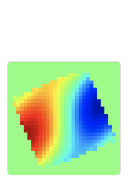

#   FCC-ee PyWIT Model 

*This repository contains the impedance model of the FCC-ee collider.*

The intent of this package is to provide the infrastructure needed to develop the model.

---

## 🌀 Overview

This repository contains the necessary tools to develop **FCC ee Impedance/Wake Model** for the FCC-ee project.  

---

## PyWIT/xwakes 

*Toolbox to build and manipulate impedance and wake function models, usable in Xsuite, DELPHI and others*

## 🚀 Getting Started

##  Installation:
Under a conda environment with Python 3.8+ it is installed via PyPI by doing

```bash
pip install xwakes
```

##  Installation:
Xwakes can be coupled to IW2D using the executables obtained compiling the C++ code. Once the Python interface of IW2D will be completed this will not be needed anymore.

Some folders need to be created in the user's home directory. This can be automatically done by running the following command after Xwakes is installed:

```bash
python -c 'import xwakes; xwakes.initialize_pywit_directory()'
```


The IW2D executable are produced by following the IW2D README.md in https://gitlab.cern.ch/IRIS/IW2D/. After this procedure is completed the following executable files will be created in 
```bash
/path/to/iw2d/IW2D/cpp/:
```
- **flatchamber.x** 
- **roundchamber.x** 
- **wake_flatchamber.x** 
- **wake_roundchamber.x** 


These files have to be copied in the newly created folder with the command:
```bash
cp /path/to/iw2d/IW2D/cpp/*.x ~/pywit/IW2D/bin
```

Now Xwakes can be used to launch IW2D calculations.

## Get the FCC-ee repository:

```bash
git clone https://github.com/ImpedanCEI/fcc_ee_pywit_model/fcc_ee_pywit_model
```

## Simpel xample and hand son camn be found:

```bash
git clone https://github.com/ImpedanCEI/fcc_ee_pywit_model/tree/main/CEI_section_meeting
```


## 📁 Contents

- **Different optics have been analyzed:**
    - **GHC V23 by K. Oide**: [FCCWeek_Optics_Oide_230606](https://indico.cern.ch/event/1202105/contributions/5408583/attachments/2659051/4608141/FCCWeek_Optics_Oide_230606.pdf)
    - **GHC V24.4 by K. Oide**: [Optics_Oide_241106](https://indico.cern.ch/event/1471642/contributions/6210189/attachments/2961576/5209132/Optics_Oide_241106.pdf)
    - **GHC V23 by K. Oide**: [Optics_Oide_bx*:techi_250424](https://indico.cern.ch/event/1509196/contributions/6480794/attachments/3055731/5402860/Optics_Oide_bx*_techi_250424.pdf)
    - **LCC by P. Raimondi**: [LCC optics developments.pdf ](https://indico.cern.ch/event/1566197/contributions/6605749/attachments/3106610/5506004/LCC%20optics%20developments.pdf)


- Various examples demonstrating how the code works are available,

- The collimators group has been specialized to give the possibility to have different
 emittances in x/y.

#  


